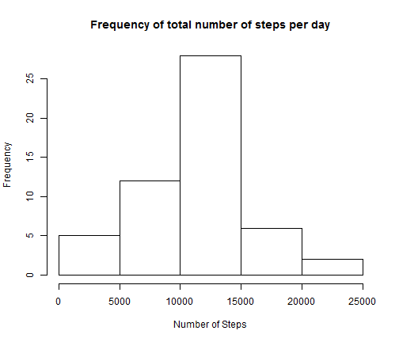
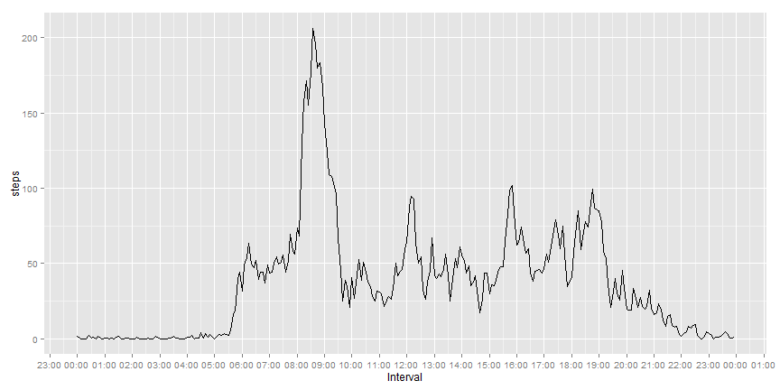
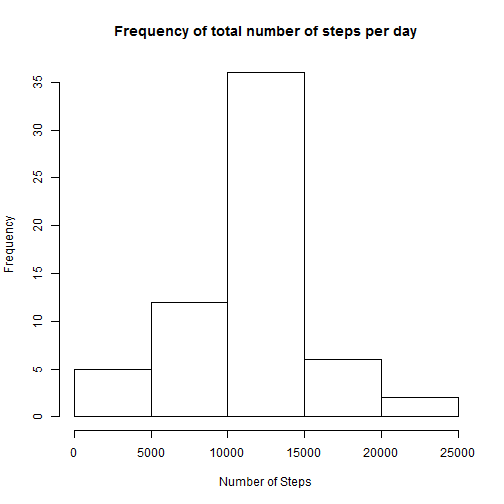
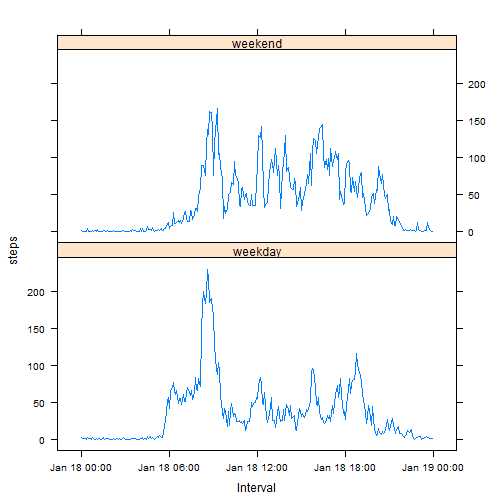

Peer Assignment 1
========================================================

**1st step: Loading and preprocessing the data**

In order to process the data, we need to read them from the csv file. For this reason, 
we use command read.csv in order to transfer the data in a data frame.


```r
data = read.csv("activity.csv", header = TRUE)
```

**2nd step: What is mean total number of steps taken per day?**

First, we make a histogram of the total number of steps taken each day


```r
data.sum <- aggregate(x = data[c("steps")], FUN = sum,by = list(Group.date = data$date))
hist(x=data.sum$steps,xlab="Number of Steps",
     main="Frequency of total number of steps per day")
```

 

Then, we can calculate and report the mean and median total number of steps taken per day
by using R functions mean an median. In order to have correct result, we need to ignore/exclude NA values.

The mean value of total number of steps/day is 10766.19. The median is 10765. 


```r
row.has.na <- apply(data.sum, 1, function(x){any(is.na(x))})
steps_non_NAS <- data.sum$steps[!row.has.na]

mean(steps_non_NAS)
```

```
## [1] 10766.19
```

```r
median(steps_non_NAS)
```

```
## [1] 10765
```

**3rd step: What is the average daily activity pattern?**

In order to see the specific pattern, we made a time series plot (i.e. type = "l") of the 
5-minute interval (x-axis) and the average number of steps taken, averaged across all days (y-axis). In order to make the plot, we used ggplot2


```r
library(ggplot2)
```

```
## Warning: package 'ggplot2' was built under R version 3.1.1
```

```r
library(scales)
```

```
## Warning: package 'scales' was built under R version 3.1.1
```

```r
hours <- data$interval%/%100
minutes <- data$interval%%100
hours <- as.character(hours)
minutes <- as.character(minutes)
interval_time <- paste(hours,":",minutes)
Sys.setlocale("LC_TIME", "English") 
```

```
## [1] "English_United States.1252"
```

```r
pos <- as.POSIXct(interval_time, format="%H : %M")
data$pos1<- strftime(pos, format="%H:%M")

row.has.na <- apply(data, 1, function(x){any(is.na(x))})
data_new <- data[!row.has.na,]

data.sum2 <- aggregate(x = data_new[c("steps")], FUN = mean, 
                      by = list(Interval = data_new$pos1))


data.sum2$Interval <- as.POSIXct(data.sum2$Interval, format="%H:%M")

ggplot(data = data.sum2, aes(Interval,steps)) + 
    geom_line() +
    scale_x_datetime(labels = date_format("%H:%M"),breaks = "1 hour")
```

 

From the plot, we can see there is a large peak on the average daily pattern between 
08:00 and 09:00 and some smaller peaks at 12:00, 16:00 and 19:00.

With the following R code chank we saw that the 5-minute interval that contains the maximum number of steps on average across all the days in the dataset is 08:35. 


```r
max_interval_5 <- data.sum2[which(data.sum2$steps == max(data.sum2$steps)),1]
max_interval_5
```

```
## [1] "2015-01-18 08:35:00 EET"
```


**4th step: Imputing missing values**

We calculated the total number of missing values in the dataset with the following code.
The total number of rows with missing values is 2304


```r
row.has.na <- apply(data, 1, function(x){any(is.na(x))})
length(which(row.has.na))
```

```
## [1] 2304
```


In order to fill in all of the missing values in the dataset we calculated the means for each 5-minute interval . Then we imputed the missing values with the relative mean value.


```r
row.has.na <- apply(data, 1, function(x){any(is.na(x))})
data_no_NAs <- data[!row.has.na,]
data.sum3 <- aggregate(x = data_no_NAs[c("steps")], FUN = mean, 
                       by = list(interval = data_no_NAs$interval))
```

Then we created a new dataset that is equal to the original dataset 
 but with the missing data filled in.
 

```r
data_imputed <- data
data_imputed$matched_data <- data.sum3$steps[match(data$interval,data.sum3$interval)]
data_imputed$steps[is.na(data_imputed$steps)] <-data_imputed$matched_data[is.na(data_imputed$steps)]
data_imputed$matched_data <- NULL
```

Then we made a histogram of the total number of steps taken each day 
and we calculated and the mean and median total number of steps taken per day.


```r
data.sum4 <- aggregate(x = data_imputed[c("steps")], FUN = sum, 
                      by = list(Group.date = data_imputed$date))
hist(x=data.sum4$steps,xlab="Number of Steps", 
     main="Frequency of total number of steps per day")
```

 

```r
mean(data.sum4$steps)
```

```
## [1] 10766.19
```

```r
median(data.sum4$steps)
```

```
## [1] 10766.19
```

One can see that between the two pairs of values, only the median one differs between the one taken from the imputed and the non-imputed dataset. The reason that there is no difference between the two mean values is that we imputed the missing values with the means  for each 5-minute interval. Therefore these values did not change the total mean of the total number of steps taken per day. But in the imputed dataset, the mean value had now the most occurences and therefore mean and median share now the same value.

**5th step: Are there differences in activity patterns between weekdays and weekends?**

In order to answer to the specific question, we created a new factor variable in the dataset with two levels – “weekday” and “weekend” indicating whether a given date is a weekday or weekend day. In order to achieve it we created the following R code chunk:


```r
data_imputed$day <-weekdays(as.Date(data_imputed$date))
day_attribute <- character(nrow(data_imputed))

for (i in 1:nrow(data_imputed))
{
    if(data_imputed$day[i] == "Saturday" || data_imputed$day[i] =="Sunday"){
        day_attribute[i] <- "weekend"
    }
    else
    {
        day_attribute[i] <- "weekday"
    }
}
data_imputed$day_attribute <- as.factor(day_attribute)
data_imputed$day<-NULL
```


Then, we made a panel plot containing a time series plot (i.e. type = "l") 
of the 5-minute interval (x-axis) and the average number of steps taken, 
averaged across all weekday days or weekend days (y-axis).


```r
library(lattice)

hours <- data_imputed$interval%/%100
minutes <- data_imputed$interval%%100
hours <- as.character(hours)
minutes <- as.character(minutes)
interval_time <- paste(hours,":",minutes)
pos <- as.POSIXct(interval_time, format="%H : %M")
data_imputed$pos1 <- strftime(pos, format="%H:%M")

data.sum5 <- aggregate(x = data_imputed[c("steps")], FUN = mean, 
                       by = list(Interval = data_imputed$pos1, day=day_attribute))

data.sum5$Interval <- as.POSIXct(data.sum5$Interval, format="%H:%M")
xyplot(steps ~ Interval | day, data = data.sum5, layout = c(1, 2), type = "l")
```

 


From the plots, we can see that the average number of steps taken, 
averaged across all weekday days, present a very large peak at 08:35 (~250).
On the other hand, the average number of steps taken, averaged across all weekend days
have more peaks (~150) than weekdays but none of them reach the maximum peak mentioned before.
